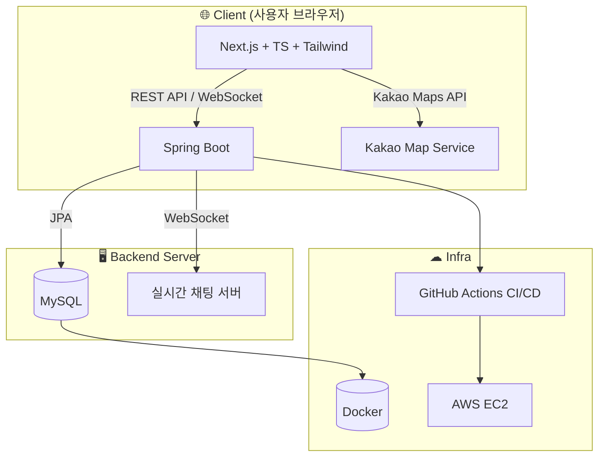

# 🗺️ HanaZoom - 우리 동네 주식 맛집 지도

## 📝 프로젝트 소개

**HanaZoom**은 지역별 **주식 투자 트렌드**를 한눈에 보여주는 **지도 기반 웹 서비스**입니다. 사용자는 거주지나 관심 지역의 **인기 주식 순위**를 지도로 확인하고, 주변 투자자들과 **실시간 소통**할 수 있습니다. 지역 특성에 맞춘 주식 추천과 커뮤니티 기능을 통해, **우리 동네의 투자 정보**를 쉽고 재미있게 얻을 수 있는 플랫폼을 지향합니다.

## 🌟 주요 기능

- **지도 기반 시각화**: 카카오 지도 API를 이용하여 **시/구/동 단위**의 행정구역 경계를 표시하고, 각 지역별로 인기 주식 정보를 시각적으로 보여줍니다.
- **다단계 줌 인터랙션**: 지도 **확대/축소 수준**에 따라 행정구역 단위가 자동으로 전환되어 원하는 범위의 투자 트렌드를 파악할 수 있습니다.
- **인기 종목 순위 및 실시간 데이터**: 지역별 **인기 주식 순위**와 종목별 실시간 데이터를 제공하며, 5분 주기로 갱신됩니다.
- **지역 특성 기반 추천**: 지역의 특성(예: IT 종사자 밀집, 부유층 거주 등)에 따라 **맞춤형 주식 정보**를 제공합니다.
- **회원 계정 및 개인화**: 회원가입/로그인을 통해 지역과 연동된 개인화 서비스를 제공합니다.
- **실시간 지역 커뮤니티 (채팅)**: 지역 주민 간 **실시간 채팅**으로 투자 정보를 공유할 수 있습니다.
- **종목별 커뮤니티 게시판**: 특정 종목 게시판에서 글과 댓글로 소통하며, 좋아요 및 인기글 기능을 지원합니다.
- **투표형 게시글**: 상승/하락에 대한 간단한 투표 기능 제공 (예정).

## 🛠 기술 스택

| 분야         | 기술 스택                                                               |
| ------------ | ----------------------------------------------------------------------- |
| **Frontend** | Next.js, TypeScript, TailwindCSS, Kakao Maps API, Zustand, WebSocket    |
| **Backend**  | Spring Boot, Spring Security + JWT, JPA(Hibernate), WebSocket, REST API |
| **Database** | MySQL (지역/주식/회원/커뮤니티), Flyway (DB 마이그레이션 관리)          |
| **Infra**    | Docker, Docker Compose, Nginx, GitHub Actions (CI/CD), AWS EC2          |
| **ETC**      | Kakao REST API (주소 → 좌표 변환), ESLint & Prettier (코드 스타일)      |

## 📦 프로젝트 구조

```

HanaZoom/
├── FE/                          # 프론트엔드
│   ├── app/                     # 페이지 및 API 설정
│   ├── components/              # 재사용 컴포넌트
│   │   └── ...
│   ├── data/                    # 실제 데이터 처리
│   ├── lib/api/                 # API 함수
│   ├── types/                   # 타입 정의
│   └── public/                  # 정적 파일
├── BE/                          # 백엔드
│   └── HanaZoom/                # Spring Boot 프로젝트
│       ├── global/service/      # 공통 서비스
│       ├── global/controller/   # 공통 컨트롤러
│       └── ...
└── Infra/                       # 인프라 설정

```

## 🗂 아키텍처 다이어그램



## 🚀 시작하기

### Backend 실행

```bash
cd BE/HanaZoom
./gradlew bootRun
```

### Frontend 실행

```bash
cd FE
npm install
npm run dev
```

브라우저에서 `http://localhost:3000` 접속 후 이용할 수 있습니다.

## 📊 데이터베이스 구조

- **regions**: 지역 정보 (시/구/동 계층 구조, 좌표 포함)
- **stocks**: 주식 종목 정보 (심볼, 이름, 시장, 섹터, 실시간 가격/변동률 등)
- **region_stocks**: 지역별 인기 종목 순위 및 인기도 점수
- **members**: 사용자 계정, 주소/좌표, 지역 매핑 정보
- **posts**: 커뮤니티 게시글 (일반/투표형, 좋아요, 댓글 수, 조회 수 등)
- **comments**: 게시글 댓글 (좋아요 포함)
- **polls / poll_responses**: 투표형 게시글과 사용자 응답 관리
- **likes**: 게시글/댓글 좋아요 내역
- **attachments**: 게시글 첨부파일 메타데이터

## 🎨 UI/UX 가이드라인

- **컬러 테마**: 녹색 계열 (`green-50 ~ emerald-100`)
- **다크 모드** 지원
- **반응형** 웹 (모바일/태블릿/PC)
- **아이콘/이모지 활용**으로 직관적인 UX
- **부드러운 애니메이션**과 인터랙션

## 📝 API 구조

### Auth

- `POST /api/v1/members/signup` – 회원가입
- `POST /api/v1/members/login` – 로그인 (JWT 발급)
- `POST /api/v1/members/logout` – 로그아웃
- `POST /api/v1/members/refresh` – 토큰 재발급

### Regions

- `GET /api/v1/regions` – 지역 목록 조회
- `GET /api/v1/regions/{regionId}/stats` – 특정 지역 통계
- `GET /api/v1/regions/{regionId}/top-stocks` – 지역 인기 주식 상위 3개

### Stocks

- `GET /api/v1/stocks/{symbol}` – 종목 상세 조회
- `GET /api/v1/stocks/ticker` – 주식 티커 데이터
- `GET /api/v1/stocks/search?query={키워드}` – 종목 검색

### Community

- 게시글 작성/조회/수정/삭제, 좋아요
- 댓글 작성/조회/삭제, 좋아요
- 인기 게시글 조회

### WebSocket

- `ws://<server>/ws/chat/region?regionId={id}&token={JWT}`
  → 지역 채팅방 연결

## 🔒 환경 변수

- `KAKAO_MAP_API_KEY`: 카카오 지도 API 키
- `KAKAO_REST_API_KEY`: 카카오 REST API 키
- `DB_URL`: 데이터베이스 URL
- `DB_USERNAME`: DB 사용자명
- `DB_PASSWORD`: DB 비밀번호
- `JWT_SECRET`: JWT 비밀키

## 🔮 향후 추가 예정 기능

- 투표 기반 주가 예측
- 관심 종목/지역 알림
- 실시간 차트 대시보드
- 모바일 앱 (PWA)
- CI/CD, Docker 기반 배포
- 보안 강화 및 HTTPS 적용

## 📄 라이선스

이 프로젝트는 **MIT License**로 배포됩니다.
