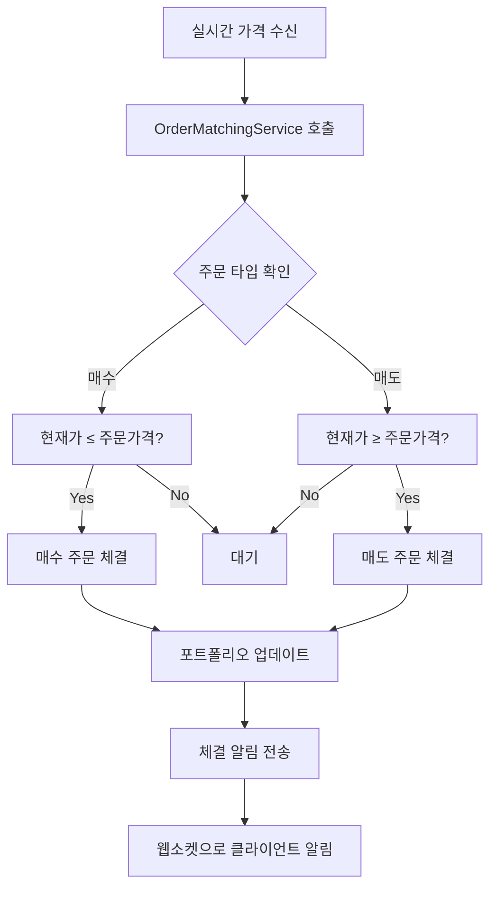

# TIL 2025-09-02

## 📈 호가창 기반 주문 체결 시스템 구현

### 🎯 요구사항
- 현재가가 주문가격보다 유리한 방향으로 움직일 때 체결
- 호가창에서 가장 하위 우선순위로 처리 (즉시 체결)
- 실시간 가격 변동에 따른 자동 체결

### 🔧 구현한 컴포넌트

#### 1. OrderMatchingService
```java
// 매수 주문: 현재가 ≤ 주문가격 → 체결
// 매도 주문: 현재가 ≥ 주문가격 → 체결
```

**주요 기능:**
- `processOrderMatching()`: 실시간 가격 변동 시 주문 매칭
- `processBuyOrders()`: 매수 주문 체결 로직
- `processSellOrders()`: 매도 주문 체결 로직
- `executeOrder()`: 실제 체결 실행
- `updatePortfolio()`: 포트폴리오 자동 업데이트
- `sendExecutionNotification()`: 체결 알림 전송

#### 2. OrderRepository 확장
```java
// 매수 주문을 가격 내림차순으로 조회
@Query("SELECT o FROM Order o JOIN o.stock s WHERE s.symbol = :stockCode AND o.orderType = 'BUY' AND o.status = 'PENDING' ORDER BY o.price DESC")

// 매도 주문을 가격 오름차순으로 조회  
@Query("SELECT o FROM Order o JOIN o.stock s WHERE s.symbol = :stockCode AND o.orderType = 'SELL' AND o.status = 'PENDING' ORDER BY o.price ASC")
```

#### 3. StockWebSocketHandler 연동
- 실시간 가격 데이터 수신 시 자동으로 `OrderMatchingService` 호출
- 체결 알림 웹소켓 전송 기능 추가

#### 4. OrderServiceImpl 개선
- 시장가 주문 시 즉시 체결 처리
- 주문 생성 후 매칭 서비스 연동

### 📊 체결 로직 흐름



### 🎯 체결 조건

#### 매수 주문
- **조건**: `현재가 ≤ 주문가격`
- **예시**: 50,000원에 매수 주문 → 현재가가 49,000원이 되면 체결
- **우선순위**: 가격이 높은 순서대로 (내림차순)

#### 매도 주문  
- **조건**: `현재가 ≥ 주문가격`
- **예시**: 50,000원에 매도 주문 → 현재가가 51,000원이 되면 체결
- **우선순위**: 가격이 낮은 순서대로 (오름차순)

### 🔄 실시간 처리
1. **KIS 웹소켓**에서 실시간 가격 수신
2. **StockWebSocketHandler**에서 `OrderMatchingService` 호출
3. **매칭 조건** 확인 후 즉시 체결
4. **포트폴리오** 자동 업데이트
5. **웹소켓**으로 체결 알림 전송

### ✅ 완성된 기능
- ✅ 호가창 기반 주문 매칭 엔진
- ✅ 실시간 주문 체결 서비스
- ✅ 포트폴리오 자동 업데이트
- ✅ 체결 알림 시스템

### 🚀 다음 단계
- [ ] 사용자별 웹소켓 세션 관리
- [ ] 체결 내역 상세 조회
- [ ] 부분 체결 처리
- [ ] 주문 취소 시 매칭에서 제외