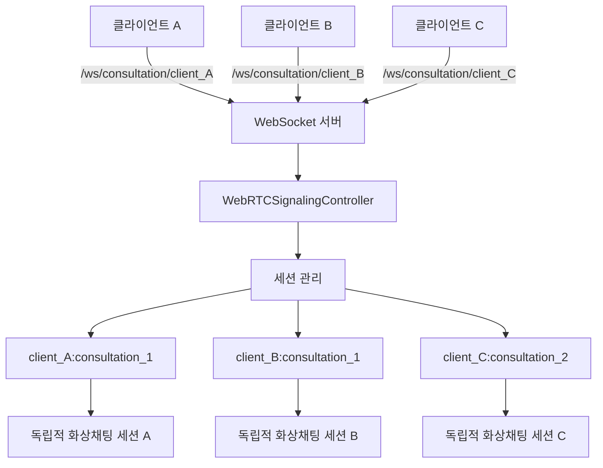

# TIL 2025-09-05

## 🎯 오늘 구현한 것

### 1. WebRTC 다중 클라이언트 지원 시스템 구현

- **문제**: 현재 화상채팅 서버가 하나의 엔드포인트로만 동작하여 여러 클라이언트가 동시에 이용할 때 세션 충돌 및 격리 문제가 발생할 수 있었음.
- **해결**: WebSocket 엔드포인트에 클라이언트 ID를 추가하여 각 클라이언트별로 독립적인 세션을 생성하고, 클라이언트 간 완전한 격리를 보장하는 시스템을 구현함.
- **적용**: 백엔드 WebSocket 설정부터 프론트엔드 연결 로직까지 전면 수정하여 다중 클라이언트 동시 지원이 가능하도록 개선.

```java
// BE/HanaZoom/src/main/java/com/hanazoom/global/config/WebSocketConfig.java
// 새로운 엔드포인트: 클라이언트별 구분
registry.addEndpoint("/ws/consultation/{clientId}")
        .setAllowedOriginPatterns("*")
        .withSockJS();

// 기존 엔드포인트: 호환성 유지
registry.addEndpoint("/ws/consultation")
        .setAllowedOriginPatterns("*")
        .withSockJS();
```

### 2. 클라이언트별 세션 격리 시스템

- **핵심**: `clientId:consultationId` 형태의 복합 키로 세션 관리
- **구현**: `WebRTCSignalingController`에서 클라이언트 ID를 추출하고 세션 키를 생성하여 각 클라이언트가 독립적인 화상채팅 세션에서 동작하도록 보장
- **로깅**: 클라이언트 ID를 포함한 상세 로그로 디버깅 및 모니터링 개선

```java
// BE/HanaZoom/src/main/java/com/hanazoom/domain/consultation/websocket/WebRTCSignalingController.java
// 클라이언트별 상담 세션 생성 또는 참여
String sessionKey = clientId + ":" + consultationId;
ConsultationSession session = activeSessions.computeIfAbsent(sessionKey, 
    key -> new ConsultationSession(consultationId, clientId));

log.info("클라이언트 {}에서 사용자 {}가 상담 {}에 참여 시도 (역할: {})", 
    clientId, userId, consultationId, userRole);
```

### 3. WebSocket 인증 인터셉터 개선

- **기능**: WebSocket 연결 시 URL에서 클라이언트 ID를 자동 추출하고 세션에 저장
- **구현**: `WebSocketAuthInterceptor`에서 destination 헤더를 파싱하여 클라이언트 ID를 추출하고 세션 속성에 저장
- **호환성**: 클라이언트 ID가 없는 경우 기본값(`'default'`)으로 처리하여 기존 코드와의 호환성 유지

```java
// BE/HanaZoom/src/main/java/com/hanazoom/global/interceptor/WebSocketAuthInterceptor.java
private String extractClientIdFromDestination(StompHeaderAccessor accessor) {
    List<String> destinations = accessor.getNativeHeader("destination");
    if (destinations != null && !destinations.isEmpty()) {
        String destination = destinations.get(0);
        // /ws/consultation/{clientId} 형태에서 clientId 추출
        if (destination != null && destination.contains("/ws/consultation/")) {
            String[] parts = destination.split("/");
            if (parts.length >= 4) {
                return parts[3]; // {clientId} 부분
            }
        }
    }
    return "default";
}
```

### 4. 프론트엔드 클라이언트 ID 관리 시스템

- **자동 생성**: `getCurrentClientId()` 함수로 브라우저 세션 기반 고유 ID 생성
- **세션 유지**: `sessionStorage`를 사용하여 브라우저 새로고침 시에도 클라이언트 ID 유지
- **WebSocket 연결**: 클라이언트 ID를 포함한 URL로 WebSocket 연결

```typescript
// FE/lib/utils/clientId.ts
export function generateClientId(): string {
  const existingClientId = sessionStorage.getItem('hanazoom_client_id');
  if (existingClientId) {
    return existingClientId;
  }

  const clientId = `client_${Date.now()}_${Math.random().toString(36).substr(2, 9)}`;
  sessionStorage.setItem('hanazoom_client_id', clientId);
  return clientId;
}

// FE/hooks/useWebRTC.ts
const socket = new SockJS(`http://localhost:8080/ws/consultation/${clientId}?token=${encodeURIComponent(accessToken)}`);
```

### 5. 다중 클라이언트 테스트 페이지 구현

- **기능**: 여러 클라이언트가 동시에 화상채팅을 이용할 수 있는지 테스트하는 전용 페이지
- **UI**: 클라이언트 ID 생성/관리, 상담 설정, 화상채팅 룸을 통합한 테스트 환경 제공
- **테스트 시나리오**: 동일한 상담 ID로 여러 클라이언트 테스트, 다른 상담 ID로 독립 테스트 등 다양한 시나리오 지원

```typescript
// FE/app/webrtc-multi-client-test/page.tsx
const handleGenerateNewClientId = () => {
  const newClientId = resetClientId();
  setCurrentClientId(newClientId);
  setShowVideoRoom(false);
};

// 클라이언트 ID가 제공되지 않으면 자동 생성
const actualClientId = clientId || getCurrentClientId();
```

### 6. VideoConsultationRoom 컴포넌트 개선

- **클라이언트 ID 지원**: `clientId` prop 추가로 특정 클라이언트 ID 지정 가능
- **자동 생성**: 클라이언트 ID가 제공되지 않으면 자동으로 생성하여 사용
- **하위 호환성**: 기존 코드 수정 없이도 새로운 다중 클라이언트 기능 사용 가능

## 🧠 오늘의 학습

### 핵심 깨달음

> **"분산 시스템에서의 세션 격리는 단순히 ID만 추가하는 것이 아니라, 전체 아키텍처에서 일관된 격리 정책을 적용해야 한다."**

### 기술적 포인트

- **WebSocket 엔드포인트 설계**: URL 경로 변수를 활용한 클라이언트 구분이 쿼리 파라미터보다 더 명확하고 RESTful한 접근 방식
- **세션 키 설계**: `clientId:consultationId` 형태의 복합 키로 다차원 격리 구현이 단일 키보다 확장성과 명확성 면에서 우수
- **호환성 유지**: 기존 엔드포인트를 유지하면서 새로운 엔드포인트를 추가하는 점진적 마이그레이션 전략이 안전하고 효과적
- **프론트엔드 상태 관리**: `sessionStorage`를 활용한 클라이언트 ID 지속성이 `localStorage`보다 세션 기반 관리에 더 적합

### 아키텍처 설계 원칙

- **격리성**: 각 클라이언트가 독립적인 세션에서 동작하여 서로 간섭하지 않음
- **확장성**: 무제한 클라이언트 동시 지원 가능한 구조
- **가시성**: 클라이언트 ID를 통한 로그 추적과 디버깅 용이성
- **호환성**: 기존 코드와의 완전한 호환성 유지

## 🚀 내일 할 것

1. **Redis 세션 관리**: 분산 환경에서 클라이언트 세션을 공유할 수 있도록 Redis 기반 세션 관리 시스템 구현
2. **클라이언트 모니터링**: 활성 클라이언트 수, 세션 상태, 연결 품질 등을 실시간으로 모니터링하는 대시보드 구현
3. **부하 테스트**: 다중 클라이언트 동시 접속 시 서버 성능 및 안정성 검증
4. **클라이언트 ID 검증**: 서버에서 클라이언트 ID 유효성 검사 및 보안 강화

## 📊 WebRTC 다중 클라이언트 시스템 아키텍처



## 🔧 구현된 주요 기능

- ✅ 클라이언트별 WebSocket 엔드포인트 분리
- ✅ 클라이언트별 세션 격리 시스템
- ✅ 자동 클라이언트 ID 생성 및 관리
- ✅ 다중 클라이언트 테스트 환경
- ✅ 기존 코드와의 완전한 호환성
- ✅ 상세한 로깅 및 디버깅 지원

## 🎯 시스템 장점

1. **완전한 격리**: 각 클라이언트가 독립적인 세션에서 동작
2. **무제한 확장**: 이론적으로 무제한 클라이언트 동시 지원
3. **쉬운 디버깅**: 클라이언트 ID 기반 로그 추적
4. **점진적 마이그레이션**: 기존 코드 수정 없이 새 기능 사용
5. **유연한 관리**: 자동 생성 또는 수동 지정 모두 지원

---

**Today's Key Insight**: 다중 클라이언트 지원은 단순한 기능 추가가 아니라, 전체 시스템 아키텍처에서 격리와 확장성을 고려한 설계가 핵심이다.
